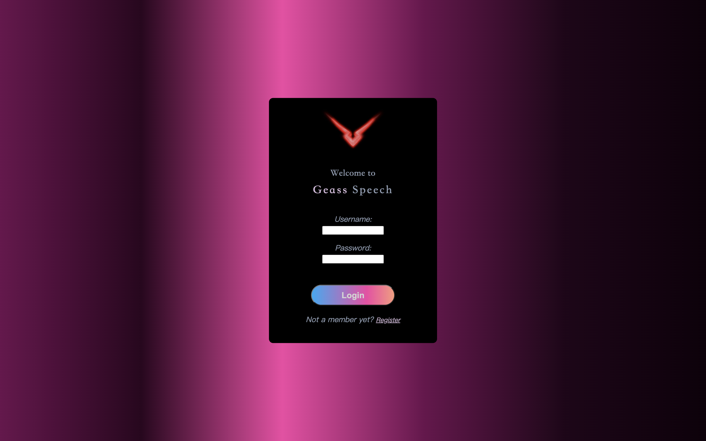

<br />

[comment]: <> (<p align="center">)

[comment]: <> (  <a href="https://github.com/github_username/repo_name">)

[comment]: <> (    )

[comment]: <> (  </a>)


  <h1 align="center">Geass Speech:  An Extended Application of End-to-End Speech Recognition Method</h1>

  <p align="center">
    Speech recognition system based on Research on end-to-end methodolgy
    


<!-- TABLE OF CONTENTS -->

<details open="open">
  <summary><h2 style="display: inline-block">Table of Contents</h2></summary>
  <ol>
    <li>
      <a href="#about-the-project">Installation & Deployment</a>
    </li>
    <li>
      <a href="#getting-started">Research & Modeling Results</a>
    </li>
    <li><a href="#acknowledgements">Getting Start with Geass Speech</a></li>
    <li><a href="#license">License</a></li>
  </ol>
</details>


<!-- ABOUT THE PROJECT -->

## Installation & Deployment
The application in the project is built with Django framework in Python. To deploy the project on your machine, make sure you have latest Python and Pip, stands for the pacakge management tool for Python, installed first. <br>
<br>
Python 3: go to <a href = "https://python.org">Python Website</a> to download the latest version.<br>
<br>
Pip3: <br>
Install via Linux command
```
sudo apt-get -y install python3-pip
```
Install via Mac command
```
brew install python3
```
Note:installing Python3 via HomeBrew automatically has pip3 installed.<br>

To deploy the project on local, virtual environment is encouraged for easier and clearer package management. Use command<br>
```
pip3 install pipenv
```
to install pipenv for creating Python virtual environment. 
Pipenv makes useof Pipfile and Pipfile.lock to replaces requirements.txt.<br>
Spawn a shell in virtual environment<br>
```
pipenv shell
```
The pipfile in the project provides all the packages with specific versions required to run the application. 
```
Pipfile
Pipfile.lock
```
Go to the root directory of project and install all the dependecies on your machine using
```python
pipenv install # this command will install all the packages in pipfile
```
The last step installs all packages required for machine learning modeling and deploy training a new model. The dependencies on software appllication is in /Application/ directory. Make sure you run the above command again to get packages for running the server.

The databse service used in the project is MySQL. Make sure you installed MySQL on your machine. <br>
Connecting the server to MySQL database is straighforward. After you created a new database, just configure the connection in setting.py in /ASR_web/ directory. 
```
DATABASES = {
    'default': {
        'ENGINE': 'django.db.backends.mysql',
        'NAME': 'ASR',
        'HOST': 'localhost',
        'USER': 'root',
        'PASSWORD':'yourpassword'
    }
}
```
Django provides command to build the required tables from the project straightforardlly by applying command
```
python manage.py makemigrations
```
followed with migrate command
```
python manage.py migrate
```


### Built With
```python
#Pipfile
torch = "*"
torchaudio = "*"
django = "*"
mysqlclient = "*"
djangorestframework = "*"
djoser = "*"
djangorestframework-simplejwt = "*"
numpy = "*"
```


<!-- GETTING STARTED -->

## Research & Modeling Results

The project is mainly based on end-to-end methodlogy. The motivation of the project is not only replace the traditional HMM-GMM statistical approach of speech recognition, but also boost the accuracy by making improvements of modeling compared to Deep Speech. The design of the modeling, combines the proper feature engineering and audio augmentation boost the accuracy compared to Deep Speech and Deep Speech 2 on LibriSpeech Test-clean test set, achieving about 4% WER.<br> 
The detailed research is conatined in the report of this project, which will not be expanded here. 
The modeling is made up of layer normalization, Residual Neural Network and LSTM. The techniques used for audio augmentation is sepctrogram masking, and the features applied is Mel-spectrogram. 
<br>
The ASR model is first trained on LibriSpeech train-other-500 dataset, and then the train model is used as pretrained model to train on LibriSpeech train-clean-360. The total speech hours is 860-hours, with British Accent Reading. The training time on RTX 6000 GPU is about 60 hours.<br>
The plot below provides visualization of the performance of the model:


In validation dataset, the evaluation on decoded texts with ground truth label is shown below:


<!-- ACKNOWLEDGEMENTS -->

## Getting Start with Geass Speech

  Now it is time to get start with Geass Speech.<br>
  Go to /Application/ directory and run following command:
  ```
  python manage.py runserver
  ```
  Then click on the http://127.0.0.1:8000/ link to open the server.
  The login page allows user to login with register username and password.

  
  The registration page is designed for first-time users. You can register an account to use the speech recognition in Geass.
  
  When you succesfully login the system, you can access to the speech recognition module of the application. Meanwhile, you can check your profile information on the left swipe bar. You can click on the button Go and start to record your speech for 10 seconds and see the decoded texts.
  
  
By clicking on the link of all your documents, you can access to all the documents you save with modification or extention on the texts recognized by your previous speech. The Geass Speech is here to boost our text editing efficiency.
  


<!-- LICENSE -->

## License

Distributed under the Apache License. See <a href="https://git-teaching.cs.bham.ac.uk/mod-team-project-2020/fear/-/blob/master/LICENSE">`LICENSE` </a>for more information.


<!-- MARKDOWN LINKS & IMAGES -->
<!-- https://www.markdownguide.org/basic-syntax/#reference-style-links -->

[contributors-shield]: https://img.shields.io/github/contributors/github_username/repo.svg?style=for-the-badge
[contributors-url]: https://github.com/github_username/repo/graphs/contributors
[forks-shield]: https://img.shields.io/github/forks/github_username/repo.svg?style=for-the-badge
[forks-url]: https://github.com/github_username/repo/network/members
[stars-shield]: https://img.shields.io/github/stars/github_username/repo.svg?style=for-the-badge
[stars-url]: https://github.com/github_username/repo/stargazers
[issues-shield]: https://img.shields.io/github/issues/github_username/repo.svg?style=for-the-badge
[issues-url]: https://github.com/github_username/repo/issues
[license-shield]:  https://git-teaching.cs.bham.ac.uk/mod-team-project-2020/fear/-/blob/master/LICENSE
[license-url]: https://git-teaching.cs.bham.ac.uk/mod-team-project-2020/fear/-/blob/master/LICENSE
[linkedin-shield]: https://img.shields.io/badge/-LinkedIn-black.svg?style=for-the-badge&logo=linkedin&colorB=555
[linkedin-url]: https://linkedin.com/in/github_username

<!-- REFERENCE -->

